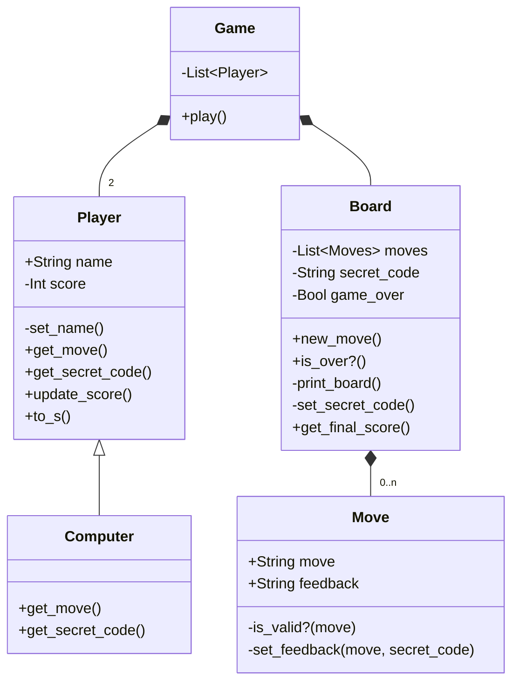
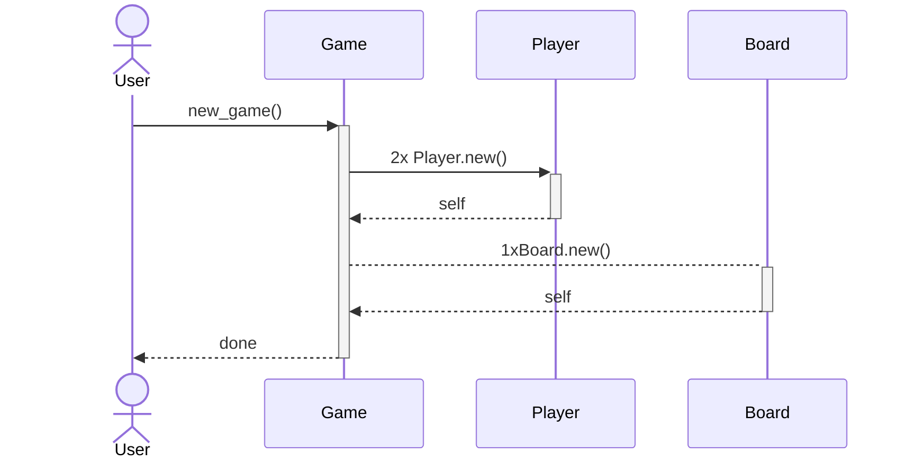
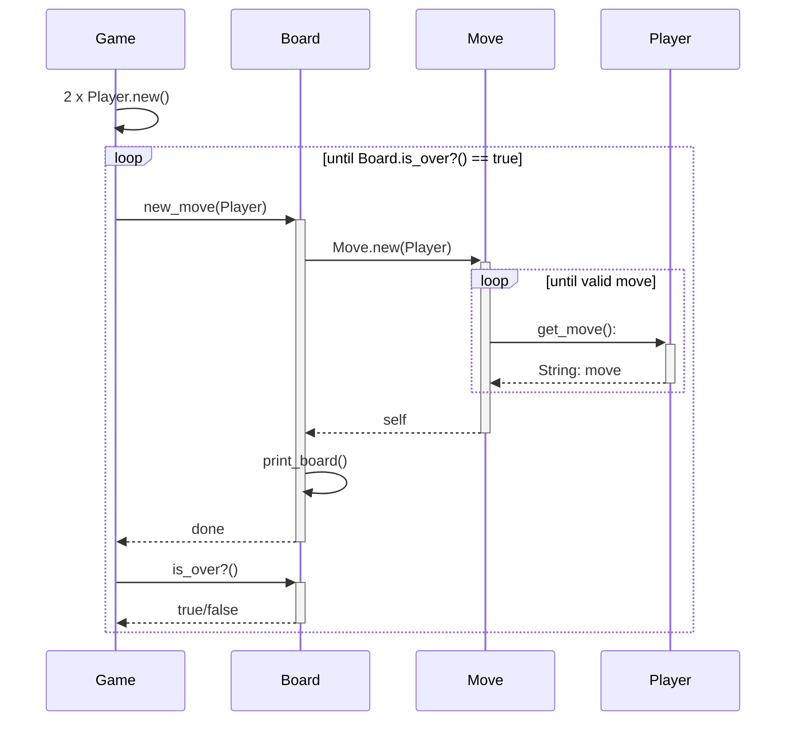

```mermaid
classDiagram
Game*--"2"Player
Player<|--Computer
Game*--Board
Board*--"0..n"Move

class Game {
  -List~Player~
  +play()
}

class Player {
  +String name
  -Int score
  -set_name()
  +get_move()
  +get_secret_code()
  +update_score()
  +to_s()
}

class Computer {
  +get_move()
  +get_secret_code()
}

class Board {
  -List~Moves~ moves
  -String secret_code
  -Bool game_over
  +new_move()
  +is_over?()
  -print_board()
  -set_secret_code()
  +get_final_score()
}


class Move {
  +String move
  +String feedback
  -is_valid?(move)
  -set_feedback(move, secret_code)
}
```

## Start new game

```mermaid
sequenceDiagram
actor User
User->>+Game: new_game()
Game->>+Player: 2x Player.new()
Player-->>-Game: self
Game-->+Board: 1xBoard.new()
Board-->>-Game: self
Game-->>-User: done
```

## New move

```mermaid
sequenceDiagram
Game->>Game: 2 x Player.new()
loop until Board.is_over?() == true

  Game->>+Board: new_move(Player)
  Board->>+Move: Move.new(Player)

  loop until valid move
    Move->>+Player: get_move():
    Player-->>-Move: String: move
  end

  Move-->>-Board: self

  Board->>Board: print_board()
  Board-->>-Game: done

  Game->>+Board: is_over?()
  Board-->>-Game: true/false
end
```
